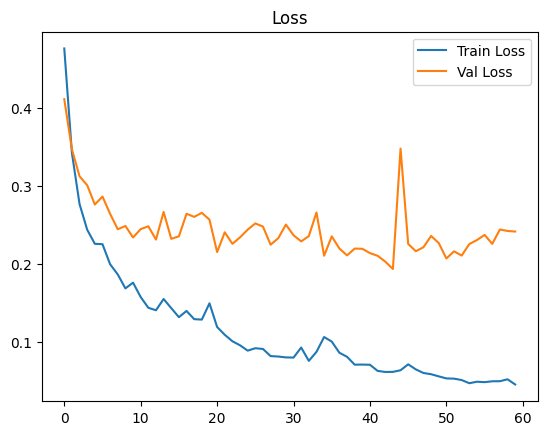
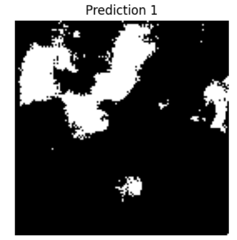

 #  Water Segmentation Project  

This project focuses on **semantic segmentation of water bodies** from multi-band satellite images.  
It includes **two implementations**: one in **TensorFlow/Keras** and another in **PyTorch** (using Hugging Face’s `segmentation_models_pytorch`).  
Finally, the trained models are deployed via a simple **Flask web app**.  

---

##  Project Structure  

```bash
water-segmentation/
│
|
│   ├── water_segmentation_tensorflow.ipynb   # TensorFlow/Keras U-Net implementation
│   ├── water_segmentation_pytorch.ipynb      # PyTorch/segmentation_models_pytorch implementation
│
├── app/                                 # Flask application for deployment
│   ├── endpoints.py                                # Main Flask backend
│   |
│   ├── templates/                            # HTML frontend with css (one-page interface)
│
├── images/                             # Results (graphs, predictions, demo screenshots)
│   
|
└── README.md                           # Project documentation
```

##  Implementations  

### 1. TensorFlow / Keras  
- Model: **U-Net** built from scratch using **Keras**.  
- Loss function: **IoU + Accuracy** metrics.  
- Dataset: 12-channel images → direct training on 5 selected channels.  

### 2. PyTorch (Hugging Face + `segmentation_models_pytorch`)  
- Models used: **U-Net, LinkNet, and others** (to be updated).  
- Used **feature engineering** to reduce input from **12 channels → 5 channels**.  
- Dataset loading and preprocessing implemented from scratch.  
---

## Dataset  

- Total samples: **306 images**  
- Split: **80% train, 10% validation, 10% test**  
- Input: Multi-band satellite images (**12 channels**)  
- Output: Binary segmentation masks (**water vs non-water**)  

---

##  Results (PyTorch Models)

| Model              | Accuracy | Loss  | IoU   |
|--------------------|----------|-------|-------|
| U-Net (ResNet50)   | 0.939    | 0.194 | 0.813 |
| FPN (ResNet34)     | 0.927    | 0.200 | 0.777 |
| PSPNet (ResNet101) | 0.905    | 0.239 | 0.718 |

---

##  Qualitative Comparison  

Below are sample predictions compared with ground truth:

| U-Net (ResNet50) | FPN (ResNet34) | PSPNet (ResNet101) |
|------------------|----------------|--------------------|
|  |  |  |

---

##  Training Curves  

**U-Net (ResNet50):**  


**FPN (ResNet34):**  


**PSPNet (ResNet101):**  


---

##  TensorFlow (Keras U-Net)

- Model: **U-Net** implemented in Keras.  
- Metrics: **IoU & Accuracy**.
---
##  Results (Tenserflow Models)

| Model              | Accuracy | Loss  | IoU   |
|--------------------|----------|-------|-------|
| U-Net              | 0.9081   | 0.2589| 0.700 | 
---
### Example Prediction  

| Ground Truth | Prediction |
|--------------|------------|
|  |  |
|  |  |


### Training Curve  


---

## 🌐 Deployment Demo  

The trained models were deployed using **Flask** with a simple one-page interface.  

- `/` → Upload image via web page  
- `/predict` → Returns segmented mask  

**Demo Screenshot:**  


